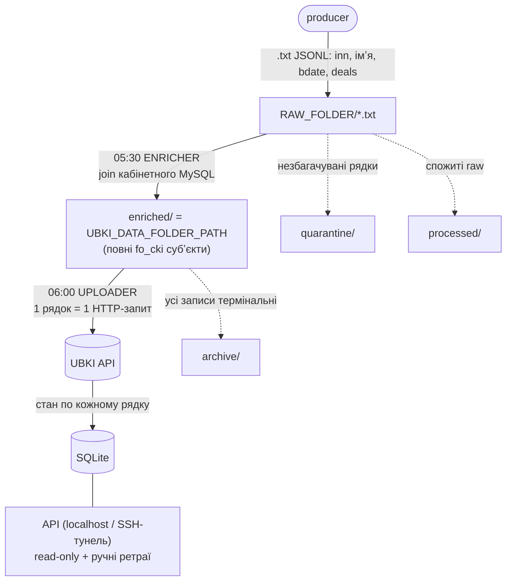
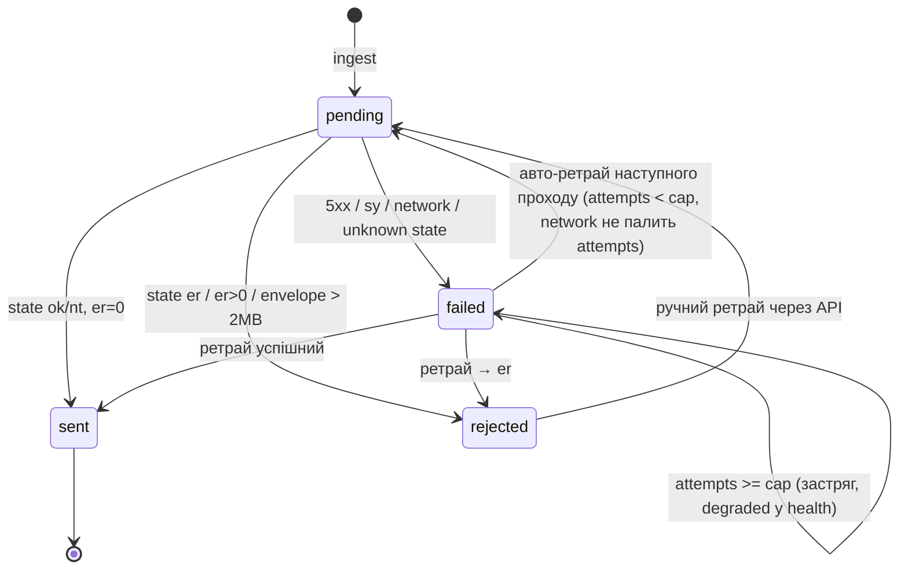

# ubki-uploader — архітектура

Щоденне вивантаження кредитних даних у UBKI (український кредитний бюро) у дві
cron-стадії. Цей документ описує, як працює вся логіка: потік даних, кожен
компонент і наскрізні інваріанти.

> Термінологія й ідентифікатори — англійською (як у коді); пояснення — українською.

## Зміст

- [Загальна картина](#загальна-картина)
- [Стадія 1 — Enricher](#стадія-1--enricher-appenricherpy)
- [Стадія 2 — Uploader](#стадія-2--uploader-appuploaderpy)
- [UBKI-клієнт](#ubki-клієнт-appubki_clientpy)
- [Стан у SQLite](#стан-у-sqlite-appdbpy)
- [Машина станів запису](#машина-станів-запису)
- [API-фасад](#api-фасад-appapipy)
- [Config](#config-appconfigpy)
- [Наскрізні інваріанти](#наскрізні-інваріанти-безпека-даних)
- [Команди](#команди)

---

## Загальна картина

Дві стадії (Київський час), кожна зі своїм `flock`-локом, тому cron і `POST /run`
ніколи не накладаються:

- **Enricher** — `python -m app.enrich`, 05:30
- **Uploader** — `python -m app.run_once`, 06:00



Файлова розкладка (у compose `enriched/`, `quarantine/`, `processed/` — субпапки
`RAW_FOLDER`, а `archive/` — субпапка інбоксу):

```
RAW_FOLDER/
  a.txt                       ← producer кидає сюди
  quarantine/  a.txt          ← незбагачувані рядки {line_no, reason, line}
  processed/   a.txt          ← спожиті raw-файли
  enriched/    a.txt          ← = UBKI_DATA_FOLDER_PATH (інбокс uploader-а)
    archive/   a.txt          ← файл, коли всі його записи термінальні
```

**Головна межа відповідальності:** enricher *легітимно парсить* рядки й будує їх
заново; uploader **ніколи не парсить** — рядок вбудовується в конверт байт-у-байт
(без `json.loads`/`dumps`).

---

## Стадія 1 — Enricher (`app/enricher.py`)

**Навіщо.** Producer дає «худий» рядок (лише `inn`, імʼя, `bdate`, `deals` із
вкладеним `deallife`), а UBKI вимагає повний субʼєкт: `idents`/`docs`/`addrs`/
`contacts`, `person_id`, `is_gone`, `dlvidobes`. Enricher добудовує це з
кабінетного MySQL (`dlref = finplugs_creditup_applications.id`).

**Потік (`run_enrich` → `process_file`):**

1. `scan_folder(folder=raw_folder)` — файли за маскою `*.txt`, старші за
   `min_file_age_sec` (захист від напівзаписаних). Субпапки та приховані файли
   пропускаються; не-маскові файли лічаться в `files_skipped` та алертяться.
2. **Ідемпотентність за `filename + sha256`** у таблиці `enriched_files` — якщо
   файл уже оброблений, пропуск.
3. `_read_numbered_lines` — непорожні рядки з їхнім **справжнім** 1-based номером
   (щоб карантин указував на правильний рядок навіть за порожніх рядків у файлі).
4. Парсинг: `unwrap_quarantine(json.loads(...))` — повторно вкинутий карантин-запис
   `{line_no, reason, line}` розгортається назад до оригіналу.
5. **Один batch-запит** `fetch_deals_data` по всіх `dlref` файлу (інʼєктований у
   тестах через параметр `fetch`).
6. `enrich_line` будує субʼєкт зі снапшоту **найновішої** заявки
   (`_sort_key` за `applied_at` з повною роздільністю часу, щоб заявки одного дня
   не зрівнялись), із `users` як fallback.
7. Записи: збагачені → атомарно в `enriched/` (`_write_enriched`, tmp+rename,
   reuse-if-identical проти подвійної відправки); карантин → `quarantine/<та сама
   назва>` (теж reuse-if-identical + атомарно); raw → `processed/`.
8. Рядок у `enriched_files`; Telegram-алерт при карантинах/помилках. Одна погана
   обробка файлу не валить весь батч (`try/except` навколо `process_file`; решта
   файлів дня збагачується, збійний ретраїться наступного запуску — стан ідемпотентний).

**Правила `enrich_line` (`app/enricher.py`):**

- `person_id = users.id`, `is_gone = "0"`, `cgrag`/`adcountry = 804` (Україна),
  мова `lng = 1`.
- **Документ (`build_doc`):** формат за номером —
  - `2 літери + 6 цифр` → паспорт-книжка, `dtype = 1`;
  - `9 цифр` → ID-картка, `dtype = 17` (без `eddr` у v1);
  - для ID-картки `dterm` = дата видачі + 10 років (`_plus_years`).
- `vdate` усіх блоків = дата `applied_at` найновішої заявки.
- Телефон (`normalize_phone`): 12 цифр із `380` → `+380…`; 10 із `0` → `+38…`.

**Причини карантину, що блокують рядок:**

| Причина | Чому |
|---------|------|
| битий JSON / не JSON-обʼєкт | неможливо розібрати |
| немає / невідомий `dlref` | немає джерела для збагачення |
| deals різних клієнтів | неоднозначний субʼєкт |
| **`inn` ≠ `users.social_number`** | **ніколи не ризикувати чужою кредитною історією** |
| непідтримуваний формат паспорта | не з чого зібрати `docs` |
| **порожній видавець `dwho`** | бюро дропає такі доки (IGNORED 3003 → CRITICAL 2077 відхиляє пакет) |
| ID-картка без дати видачі | не вивести `dterm` |
| немає валідного телефону | `contacts` — обовʼязковий блок |

Опційні словникові поля (`csex`/`family`/`ceduc`/…) у v1 свідомо не надсилаються
(мапінги id→UBKI-код живуть у коді OctoberCMS, не в БД).

---

## Стадія 2 — Uploader (`app/uploader.py`)

**Потік `run_pass` → `_run_locked`:**

```
flock (run.lock)
  → scan_folder            (файли за маскою, старші за min_file_age_sec)
  → ingest_new_files       (нові за filename+sha256 → records.raw_line)
  → send_records           (кожен рядок = 1 HTTP-запит; повертає touched: set[file_id])
  → recompute              (звужено: archived_at IS NULL ∪ touched)
  → archive_completed_files
  → insert_run             (success | aborted | error)
  → Telegram-алерт
```

Кожен апдейт запису — окрема транзакція, тому крах посеред проходу не втрачає
прогресу.

**`ingest_new_files`.** Нові файли (identity = `filename + sha256`) копіюються
порядково в `records.raw_line`. З цієї миті **джерело істини — БД, а не файлова
система**: тому файл можна заархівувати, а його відхилені рядки досі ретраїти
через API. Файл із 0 рядків даних завершується як `sent`, але лічиться в
`files_empty` і алертиться (обрізаний експорт не має пройти непоміченим).

**`send_records` (серце проходу):**

1. `sendable_records`: `pending` **АБО** (`failed` І `attempts < retry_cap`),
   у порядку `file_id, line_no`.
2. Для кожного: `build_envelope` **раз** → перевірка розміру (ліміт 2 МБ на весь
   запит, конверт включно). Завеликий → `REJECTED` **локально**, без мережевого
   виклику; лічильник abort **не чіпається** (локальний reject — не доказ ні
   «UBKI живий», ні «лежить»).
3. Інакше `client.upload_record(raw_line, uuid, envelope=envelope)`. Результат
   мапиться в статус. `count_attempt = not is_network_error` — **мережеві збої не
   палять `attempts`** (аутедж не має вичерпати авто-ретраї).
4. Збирає `touched: set[file_id]` — які файли перерахувати після проходу.
5. **Abort:** 3 послідовні network-like помилки (`network_abort_threshold`) →
   `summary.aborted = True`, решта записів лишається `pending`, ранній `return`.

**Recompute (звужений).** Перераховуються статуси файлів `archived_at IS NULL`
(нові, зокрема zero-record, і незавершені) **∪** `touched`. Останнє ловить
**заархівований** файл, чий запис вручну ретраїли й повторно відіслали (він уже
не в активному наборі). Обмежено активним беклогом + роботою проходу, а не всіма
файлами БД.

**Архівація (`archive_completed_files`).** Файл їде з інбоксу, лише коли **всі
його записи термінальні** (`sent`/`rejected`). `failed`-записи тримають файл в
інбоксі. Ретраї обслуговуються з `records.raw_line`, не з файлу. Колізія імен →
`unique_target` дає `{sha[:8]}_{name}`.

**Статус проходу.** `aborted` (не `success`) при abort → правило health 25h
продовжує працювати крізь аутедж. Виняток посеред проходу → `runs.status='error'`
+ окремий Telegram, і re-raise.

---

## UBKI-клієнт (`app/ubki_client.py`)

**Сесія.** `sessid` дійсний до 23:59:59 Київ; UBKI просить автентифікуватись раз
на день. `DbSessionStore` кешує його в таблиці `meta` за Київською датою.
`python -m app.set_session <sessid>` дозволяє засіяти сесію вручну (коли auth
неможливий через IP-whitelist).

**Конверт (`build_envelope`).** Рядкова інтерполяція
`{"reqtype":"u","reqidout":<uuid>,"reqreason":"0","data":{"fo_cki":<raw_line>}}`
— рядок **ніколи** не re-серіалізується.

**`upload_record` → `_post_record`:**

- Мережева помилка → `FAILED`, `is_network_error=True`.
- `401/403` → скинути сесію, повернути `None` → **один** re-auth → повтор; якщо
  знову → «session rejected twice» (network-like, щоб abort спрацював, без
  per-record auth-шторму — UBKI забороняє часту авторизацію).
- На `200`-body: `sentdatainfo.main_errcode` / top-level `errcode` **2014** →
  re-auth. Per-component `errcode` в `items[]` — **ніколи** не re-auth.
- **`state` на body перемагає HTTP-код лише для `< 500`** (UBKI шле валідаційні
  відхилення як HTTP 400 з `state=er`); 5xx завжди транспортний збій незалежно
  від тіла (сторінка помилки шлюзу не має перемогти abort-логіку).

**Мапінг `_map_state`:**

| `state` | лічильники | результат |
|---------|-----------|-----------|
| `ok` / `nt` | `er > 0` | `REJECTED` (частковий: компонент відхилив пакет) |
| `ok` / `nt` | `er = 0` | `SENT` (`nt`/`ig > 0` → `has_warnings`, у алерт) |
| `er` | — | `REJECTED` (потрібен ручний розбір) |
| `sy` | — | `FAILED` + `is_network_error` (system error, бекоф → рахується в abort) |
| інше | — | `FAILED` (`unknown state`) |

---

## Стан у SQLite (`app/db.py`)

Таблиці: `files`, `records`, `runs`, `meta`, `enriched_files`. Режим WAL.

- **Статуси записів:** `pending | sent | failed | rejected`.
- **Статус файлу — чистий агрегат** (`recompute_file_status`):

  | набір статусів записів | статус файлу |
  |------------------------|--------------|
  | `{}` або `⊆ {sent}` | `SENT` (0 записів → тривіально завершений → архів) |
  | `{pending}` | `PENDING` |
  | містить `failed` | `FAILED` |
  | `⊆ {rejected, sent}` | `REJECTED` |
  | інакше | `PARTIAL` |

- `connect(db_path, *, ensure_schema=True)` — DDL-bootstrap можна пропустити
  (API робить це раз у фабриці; PRAGMA лишаються — вони дешеві).
- `reset_records` — єдина «запис»-мутація ззовні: `failed|rejected → pending`,
  `attempts = 0`.

---

## Машина станів запису



---

## API-фасад (`app/api.py`)

Read-only факти трансмісії + токен-guarded дії. Свідомо **не CRUD** (єдині
мутації — ретраї та `POST /run`). Фабрика: `uvicorn "app.api:create_app" --factory`.

| Ендпойнт | Призначення |
|----------|-------------|
| `GET /health` | `degraded`, коли остання **успішна** run старша за 25h (дні без файлів — здорові; `aborted` не рахується), або є `rejected` / `failed`-понад-cap записи, або папка недоступна |
| `GET /runs` | історія проходів |
| `GET /files`, `/files/{id}` | статуси файлів і записів |
| `POST /files/{id}/retry`, `/records/{id}/retry` | `failed\|rejected → pending` (заголовок `X-API-Token`) |
| `POST /run` | відчеплений прохід (flock не дасть накластися на cron) |

Фабрика бутстрапить схему один раз на старті, тому per-request зʼєднання
відкриваються з `ensure_schema=False`, і API лишається standalone-safe, навіть
якщо піднявся раніше за uploader.

---

## Config (`app/config.py`)

Конфіг — **лише** з env-змінних, frozen dataclass. Тести будують `Config`
напряму (виняток — `tests/test_config.py`, що перевіряє сам парсер `load_config`).
Числові змінні читаються як `int(os.environ.get("X") or default)` — присутнє-але-
порожнє значення (напр. `RETRY_CAP=`) відкочується до дефолту, а не валить старт.

Ключові змінні: `UBKI_DATA_FOLDER_PATH`, `UBKI_LOGIN`/`UBKI_PASSWORD`, `API_TOKEN`
(обовʼязкові); `RAW_FOLDER`, `MYSQL_*` (для enricher); `RETRY_CAP` (5),
`MIN_FILE_AGE_SEC` (300), `FILE_GLOB` (`*.txt`), `TELEGRAM_*` (алерти опційні).

---

## Наскрізні інваріанти (безпека даних)

1. **Ніколи не слати двічі** — identity = `filename + sha256`; після інгесту
   істина в БД, тому файл можна архівувати, а записи досі ретраїти.
2. **Uploader не парсить рядок** — вбудовується в конверт байт-у-байт.
3. **Ніколи чужу історію** — `inn == users.social_number`, інакше карантин.
4. **Аутедж не вичерпує ретраї** — network-like не палять `attempts`; abort лишає
   `pending`; run записується як `aborted`, тому health-правило 25h працює крізь
   аутедж.
5. **Обидві стадії ідемпотентні** — крах у будь-якій точці безпечний до повторного
   запуску (атомарні записи + reuse-if-identical + ідемпотентність за identity).

---

## Команди

```bash
.venv/bin/python -m pytest -q                       # уся сюїта
python -m app.enrich  --dry-run                     # скан raw + звіт, без MySQL/записів
python -m app.enrich                                # збагачення (RAW_FOLDER + MYSQL_*)
python -m app.run_once --dry-run                    # скан + звіт, без записів у БД і відправки
python -m app.run_once                              # один реальний прохід
python -m app.set_session <sessid>                  # засіяти сесію вручну
uvicorn "app.api:create_app" --factory --port 8000  # API (factory-патерн)
docker compose up -d                                # api (uvicorn) + scheduler (supercronic)
```

> Деталі UBKI-протоколу (ендпойнти, форма конверта, коди помилок, посилання на
> wiki) — у docstring `app/ubki_client.py`. Живий статус верифікації та вимоги до
> продюсера даних — у `CLAUDE.md`.
